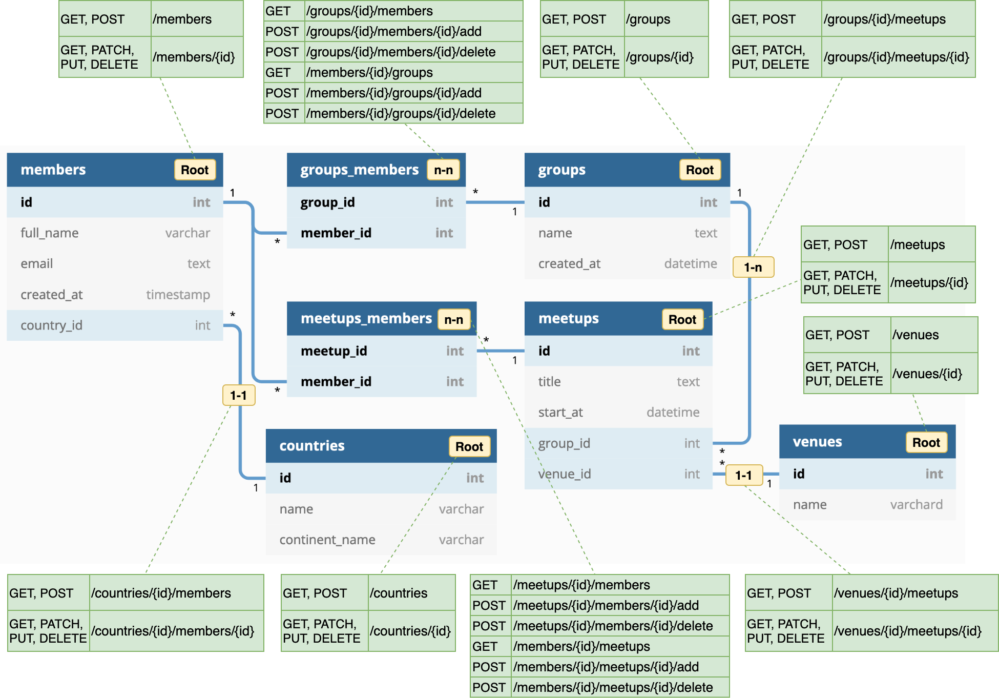

# Sapid

GraphQL / REST APIs from DB Schema Data

Sapid constructs GraphQL and/or REST API endpoints from DB schema data.

#### Features:

* Auto-configures GraphQL/REST routes, [ring](https://github.com/ring-clojure/ring) handlers, and database layer from a single line for [reitit](https://github.com/metosin/reitit), [bidi](https://github.com/juxt/bidi) and [Duct](https://github.com/duct-framework/duct)-[Ataraxy](https://github.com/weavejester/ataraxy).

* Supports APIs for `one-to-one`, `one-to-many` and `many-to-many` relationships as well as `root` entities.

* DB schema data can be retrieved from a running DB or specified with a config map.

* GraphiQL, Swagger UI, query [filters](#rest-api-filters), [sorting](#rest-api-sorting) and [pagination](#rest-api-pagination) for REST APIs come out of the box.

#### Notes:

* This project is currently in POC state and hasn't been published to Clojars yet.

### Schema to REST endpoints

Here's an example schema showing how Sapid creates endpoints according to four types of relationships: `Root`, `1-to-1`, `1-to-N` and `N-to-N`. (Please refer to [Routes per relationship types](#routes-per-relationship-types) for geneic rules.)




### Usage

#### Schema from DB

* bidi

```clojure
; Example with Integrant in Clojure codes
{:sapid.core/bidi-routes {:db (ig/ref :my-db/connection)} ; bidi routes created from DB
 ::app {:routes (ig/ref :sapid.core)} ; ::app key to call bidi.ring/make-handler with middleware
 ::server {:app (ig/ref ::app)}} ; ::server key to run jetty or equivalent server process

; Direct function call returns bidi routes created from DB
(sapid.core/make-bidi-routes (jdbc/get-connection my-db-spec)) 
```

```clojure
```

* Duct Ataraxy

```edn
; at root/module level of duct config edn
:sapid.core/duct-routes {} 
```

##### Notes:

Auto-configuration from a running DB leverages naming patterns of tables/columns to identify relationships:

1. `Root` or `N-to-N` relationship?

	A table name without `_` would be classified as `Root`, and a table name pattern of `resourcea_resourceb` such as `members_groups` is assumed for `N-to-N` tables. 

2. `1-to-1`/`1-to-N` relationship?

	If a table is not `N-to-N` and contains a column ending with `_id`, `1-to-1`/`1-to-N` relationship is identified per column.

> For other naming patterns, table names can be specified in the [config map](#sapid-config).

#### Schema from config

* bidi

```edn
:sapid.core/bidi-routes {:tables [{:name "..."}]}
```

* Duct Ataraxy

```edn
; at root/module level of duct config
:sapid.core/merge-on-duct {:tables [{:name "..."}]}
```

##### Notes:

When `tables` data is provided, Sapid uses it for table schema instead of retrieving from a DB.

> Please refer to [config section](#sapid-config-map) for the format of schema data.

### Sapid config map

Though configurable parameters vary by router types, Sapid doesn't require many config values in general. Some key concepts & list of parameters are as below:

#### Schema data

Schema data is used to specify custom table schema to construct REST APIs without querying a DB. It is specified with a list of tables under `:tables` key in the config map.

```edn
{:tables [
   {:relation-types [:root :one-n]
    :name "users"
    :columns [{:name "id"
       	       :type "text"}
              {:name "image_id"
               :type "int"}
	       ; ... more columns
	      ]
    :belongs-to ["image"]
    :pre-save-signal #ig/ref :my-project/user-pre-save-fn
    :post-save-signal #ig/ref :my-project/user-post-save-fn}
    ; ... more tables
   ]
   ; ... more parameters
}
```

##### Table details:

| Key              	 | Description                                                                                                       |
|------------------------|-------------------------------------------------------------------------------------------------------------------|
| `:name`              	 | Table name.                                                                                                       |
| `:columns`             | List of columns. A column can contain `:name` and `:type` parameters.                                             |
| `:relation-types`      | List of relation types. `:root`, `:one-n` and `:n-n` are supported.                                               |
| `:belongs-to`          | List of columns related to `id` of other tables. (`:table-name-plural` will format them accordingly.)             |
| `:pre-save-signal`     | A function to be triggered at handler before accessing DB. (It will be triggered with request as a parameter.)    |
| `:post-save-signal`    | A function to be triggered at handler after accessing DB. (It will be triggered with result data as a parameter.) |

#### Config parameter details:

| Key                     | Description                                                                  | Default Value                 |
|-------------------------|------------------------------------------------------------------------------|-------------------------------|
| `:db`                   | Database connection object.                                                  |                               |
| `:table-name-plural`    | `true` if tables uses plural naming like `users` instead of `user`.          | `true`                        |
| `:resource-path-plural` | `true` if plural is desired for URL paths like `/users` instead of `/user`.  | `true`                        |
| `:tables`               | DB schema including list of table definitions.                               | Created from `:db`            |

* Parameters specific to Duct Ataraxy

| Key                     | Description                                                                  | Default Value                 |
|-------------------------|------------------------------------------------------------------------------|-------------------------------|
| `:project-ns`           | Project namespace. It'll be used for route keys.                             | Loaded from `:duct.core`      |
| `:db-config-key`        | Integrant key for a database connection.                                     | `:duct.database/sql`          |
| `:db`                   | Database connection object. If provided Sapid won't init the :db-config-key. | Created from `:db-config-key` |
| `:db-ref`               | Integrant reference to a database connection for REST handler configs.       | Created from `:db-config-key` |
| `:db-keys`              | Keys to get a connection from a database map.                                    | [:spec]                       |

### REST API filters

Sapid uses format of `?column=[operator]:[value]` for filtering query params.

* Supported operators are `eq`, `ne`, `lt`, `le`/`lte`, `gt`, and `ge`/`gte`.

* Operators default to `eq` when omitted.

* Multiple queries are applied with `AND` operator.

##### Example:

`?id=lt:100&id=ne:1` (where `id` is less than `100` `AND` `id` is not equal to `1`.)

### REST API sorting

Sapid uses format of `?order-by=[column]:[direction]` for sorting query params.

* Supported directions are `asc` and `desc`.

* Direction defaults to `desc` when omitted.

##### Example:

`?order-by=id:desc` (order by `id` column in descending order.)

### REST API pagination

Sapid supports `limit` and `offset` params for paginating query params.

* They can be used independently.

* Using `offset` can return different results when new entries are created while items are sorted by newest first. So using `limit` with `id` filter or `created_at` filter is often considered more consistent.

##### Example:

`?limit=20&id=gt:20` (retrieve 20 items after/greater than `id`:`20`.)


### Routes per relationship types

Generic rules of route creation per relatioship types are as below:

* `Root`

| HTTP methods                               | Routes           |
|--------------------------------------------|------------------|
| `GET`, `POST`                              | `/resource`      |
| `GET`, `DELETE`, `PUT` and `PATCH`         | `/resource/{id}` |

* `1-to-1`/`1-to-N`

| HTTP methods                       | Routes                                                   |
|------------------------------------|----------------------------------------------------------|
| `GET` and `POST`                   | `/parent-resource/{parent-id}/child-resource`            |
| `GET`, `DELETE`, `PUT` and `PATCH` | `/parent-resource/{parent-id}/child-resource/{child-id}` |

* `N-to-N`

| HTTP methods | Routes                                              |
|--------------|-----------------------------------------------------|
| `GET`        | `/resource-a/{id-of-a}/resource-b`                  |
| `GET`        | `/resource-b/{id-of-b}/resource-a`                  |
| `POST`       | `/resource-a/{id-of-a}/resource-b/{id-of-b}/add`    |
| `POST`       | `/resource-b/{id-of-b}/resource-a/{id-of-a}/add`    |
| `POST`       | `/resource-a/{id-of-a}/resource-b/{id-of-b}/delete` |
| `POST`       | `/resource-b/{id-of-b}/resource-a/{id-of-a}/delete` |


### Environment

To begin developing, start with a REPL.

```sh
lein repl
```

Then load the development environment.

```clojure
user=> (dev)
:loaded
```

Run `go` to prep and initiate the system.

```clojure
dev=> (go)
:duct.server.http.jetty/starting-server {:port 3000}
:initiated
```

By default this creates a web server at <http://localhost:3000>.

When you make changes to your source files, use `reset` to reload any
modified files and reset the server.

```clojure
dev=> (reset)
:reloading (...)
:resumed
```

### Testing

Testing is fastest through the REPL, as you avoid environment startup
time.

```clojure
dev=> (test)
...
```

But you can also run tests through Leiningen.

```sh
lein test
```

## Legal

Copyright © 2021 Yohei Kusakabe
