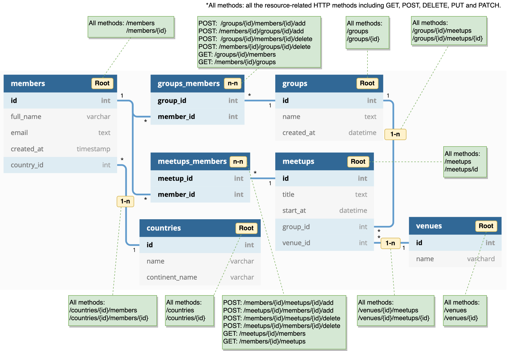

# Sapid

REST APIs from DB Schema

Sapid configures REST API endpoints from DB schema at app init time, leveraging [Integrant](https://github.com/weavejester/integrant).

#### Features:

* Auto-registers routes & handlers from a single line of config for [Duct](https://github.com/duct-framework/duct) projects with [Ataraxy](https://github.com/weavejester/ataraxy). (Currently working on [bidi](https://github.com/juxt/bidi) and [reitit](https://github.com/metosin/reitit).)

* DB schema can be retrieved from a running DB or specified with a config map.

* Query [filters](#filters), sorting and pagination come out of the box.

#### Notes:

* This project is currently in POC state and it's not been published to Clojars yet.

* Sapid aims to keep itself modular so it works with other libraries.

* GraphQL API is also under consideration.

### Schema to REST Endpoints



We can see three types of relationships in the example above: `Root`, `N-to-N` and `1-to-N`. Sapid configures REST endpoints for each type as below:

* `Root`

| HTTP methods                               | Routes           |
|--------------------------------------------|------------------|
| `GET`, `POST`                              | `/resource`      |
| `GET`, `DELETE`, `PUT` and `PATCH`         | `/resource/{id}` |

* `1-to-N`

| HTTP methods                       | Routes                                                   |
|------------------------------------|----------------------------------------------------------|
| `GET` and `POST`                   | `/parent-resource/{parent-id}/child-resource`            |
| `GET`, `DELETE`, `PUT` and `PATCH` | `/parent-resource/{parent-id}/child-resource/{child-id}` |

* `N-to-N`

| HTTP methods | Routes                                              |
|--------------|-----------------------------------------------------|
| `GET`        | `/resource-a/{id-of-a}/resource-b`                  |
| `GET`        | `/resource-b/{id-of-b}/resource-a`                  |
| `POST`       | `/resource-a/{id-of-a}/resource-b/{id-of-b}/add`    |
| `POST`       | `/resource-b/{id-of-b}/resource-a/{id-of-a}/add`    |
| `POST`       | `/resource-a/{id-of-a}/resource-b/{id-of-b}/delete` |
| `POST`       | `/resource-b/{id-of-b}/resource-a/{id-of-a}/delete` |

### Usage

#### Schema from DB

* Ataraxy in Duct

```edn
; at root/module level of duct config
:sapid.core/merge-on-duct {}
```

##### Notes:

Auto-configuration from a running DB leverages naming patterns of tables and columns to identify relationships:

1. `Root` or `N-to-N` relationship?

	A table name without `_` would be classified as `Root`, and a table name pattern of `resourcea_resourceb` such as `members_groups` is assumed for `N-to-N` tables. 

2. `1-to-N` relationship?

	If a table is not `N-to-N` and contains a column ending with `_id`, `1-to-N` relationship is identified per column.

*If other naming patterns are required, table names can be specified in the [config map](#sapid-config).

#### Schema from a Config Map

* Ataraxy in Duct

```edn
; at root/module level of duct config
:sapid.core/merge-on-duct {:router "..." :tables: [{:name "..."}]}
```

##### Notes:

When `tables` data is provided in a config, Sapid uses it for DB schema instead of retrieving from a database.

Please refer to [config section](#sapid-config) for the format of schema data.

### Sapid Config

Config values can be provided for overriding default values.

##### Example with all parameters

```edn
{:project-ns "my/project"
 :router :ataraxy
 :db {:datasource #object[]}
 :db-ref #ig/ref :my-database
 :db-config-key :duct.database/sql
 :db-keys ["db-spec"]
 :table-name-plural true
 :resource-path-plural true
 :tables [
   {:relation-types [:root :one-n]
    :name "users"
    :columns [{:name "id"
       	       :type "text"}
              {:name "image_id"
               :type "int"}
	       ; ... more columns
	      ]
    :belongs-to ["image"]
    :pre-signal #ig/ref :my/pre-signal-fn
    :post-signal #ig/ref :my/post-signal-fn}
    ; ... more tables
   ]}
```

##### Parameter Details:

| Key                   | Description                                                                  | Default Value         |
|-----------------------|------------------------------------------------------------------------------|-----------------------|
| :project-ns           | Project namespace. It'll be used for route keys.                             | From `:duct.core`     |
| :router               | Router type.                                                                 | `:ataraxy`            |
| :db                   | Database connection object. If provided Sapid won't init the :db-config-key. | From `:db-config-key` |
| :db-ref               | Integrant reference to a database connection for REST handler configs.       | From `:db-config-key` |
| :db-config-key        | Integrant key for a database connection.                                     | `:duct.database/sql`  |
| :db-keys              | Keys to get a connection from a database.                                    | [:spec]               |
| :table-name-plural    | `true` if tables uses plural naming like `users` instead of `user`.          | `true`                |
| :resource-path-plural | `true` if plural is desired for URL paths like `/users` instead of `/user`.  | `true`                |
| :tables               | DB schema including list of table definitions.                               | From `:db`            |

##### Table Details:

| Key             | Description                                                                                                       |
|-----------------|-------------------------------------------------------------------------------------------------------------------|
| :relation-types | List of relation types. `:root`, `:one-n` and `:n-n` are supported.                                               |
| :name           | Table name.                                                                                                       |
| :columns        | List of columns. A column can contain `:name` and `:type` parameters.                                             |
| :belongs-to     | List of columns related to `id` of other tables. (`:table-name-plural` will format them accordingly.)             |
| :pre-signal     | A function to be triggered at handler before accessing DB. (It will be triggered with request as a parameter.)    |
| :post-signal    | A function to be triggered at handler after accessing DB. (It will be triggered with result data as a parameter.) |

### Filters

Sapid uses format of `?column=[operator]:[value]` for filter query params.

* Supported operators are `eq`, `ne`, `lt`, `le`/`lte`, `gt`, and `ge`/`gte`.

* Operators default to `eq` when omitted.

* Multiple queries are applied with `AND` operator.

##### Example:

`?id=lt:100&id=ne:1` (where `id` is less than `100` `AND` `id` is not equal to `1`.)

### Environment

To begin developing, start with a REPL.

```sh
lein repl
```

Then load the development environment.

```clojure
user=> (dev)
:loaded
```

Run `go` to prep and initiate the system.

```clojure
dev=> (go)
:duct.server.http.jetty/starting-server {:port 3000}
:initiated
```

By default this creates a web server at <http://localhost:3000>.

When you make changes to your source files, use `reset` to reload any
modified files and reset the server.

```clojure
dev=> (reset)
:reloading (...)
:resumed
```

### Testing

Testing is fastest through the REPL, as you avoid environment startup
time.

```clojure
dev=> (test)
...
```

But you can also run tests through Leiningen.

```sh
lein test
```

## Legal

Copyright © 2021 Yohei Kusakabe
