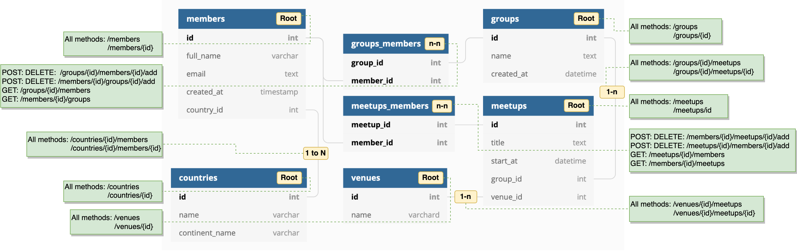

# schema-to-rest

REST APIs generated from DB Schema

This library reads DB schema from a running DB (or config) → creates routes & handlers → registers them at app initialization time of [Integrant](https://github.com/weavejester/integrant) (thus without run-time overhead).

### Schema to REST Endpoints



Currently supported logic is as the diagram above: tables are classified to be either `Root` or `N-to-N` and `1-to-N` relationships between tables are identified (yellow tags). Using those attributes identified, corresponding routes are created with handlers (green boxes).

### Logic for Identifying Table & Relations

Table types and relations are identified with the logic described as below, however these schema details can also be specified in [config map](#schema-to-rest-config).

###### Table Types

In config: `:relation-types` list in a table map

* `Root` (`:root`) or `N-to-N` (`:n-n`)
	If a table name has `_` (underscore) character, it is classified as `N-to-N` otherwise `Root`. In other words, all the root entities should be named without using `_`.

* `1-to-N` (`:one-n`)
	If a table is not `N-to-N` and contains a column ending with `_id`, it is classified as `1-to-N`.

###### Linked Table Name

In config: `:belongs-to` list in a table map

* `1-to-N` 
	String before `_id` of relations a column name is used. Table name being plural or singular is handled with `:table-name-plural` config value.
* `N-to-N`
	Strings separated by `_` from a table name are used. Table name being plural or singular is handled with `:table-name-plural` config value.

### Schema-to-REST Config

Example with default values (except `:tables`)
```
{:db-config-key :duct.database/sql
 :db-key :duct.database.sql/hikaricp
 :table-name-plural true
 :resource-path-plural true
 :tables [
   {:relation-types [:root :one-n]
    :name "users"
    :columns [{
      :name "id"
      :type "int"
      ; ... more columns
      }]
    :belongs-to ["image"]
    :signal-ref #ig/ref :my/signal}
    ; ... more tables
   ]}
```

### Route Lists per Relation Types

* Root-level (`:root`)

| Routes           | HTTP methods                               |
|------------------|--------------------------------------------|
| `/resource`      | `GET`, `POST`                              |
| `/resource/{id}` | `GET`, `DELETE`, `PUT` and `PATCH` |

* `N-to-1` / `1-to-N` relationships (`:one-n`)

| Routes                                                   | HTTP methods                       |
|----------------------------------------------------------|------------------------------------|
| `/parent-resource/{parent-id}/child-resource`            | `GET` and `POST`                   |
| `/parent-resource/{parent-id}/child-resource/{child-id}` | `GET`, `DELETE`, `PUT` and `PATCH` |

* `N-to-N` relationships

| Routes                                              | HTTP methods |
|-----------------------------------------------------|--------------|
| `/resource-a/{id}/resource-b/`                      | `GET`        |
| `/resource-b/{id}/resource-a/`                      | `GET`        |
| `/resource-a/{id-of-a}/resource-b/{if-of-b}/add`    | `POST`       |
| `/resource-b/{id-of-b}/resource-a/{if-of-a}/add`    | `POST`       |
| `/resource-a/{id-of-a}/resource-b/{if-of-b}/delete` | `POST`       |
| `/resource-b/{id-of-b}/resource-a/{if-of-a}/delete` | `POST`       |

### 

### Setup

When you first clone this repository, run:

```sh
lein duct setup
```

This will create files for local configuration, and prep your system
for the project.

### Environment

To begin developing, start with a REPL.

```sh
lein repl
```

Then load the development environment.

```clojure
user=> (dev)
:loaded
```

Run `go` to prep and initiate the system.

```clojure
dev=> (go)
:duct.server.http.jetty/starting-server {:port 3000}
:initiated
```

By default this creates a web server at <http://localhost:3000>.

When you make changes to your source files, use `reset` to reload any
modified files and reset the server.

```clojure
dev=> (reset)
:reloading (...)
:resumed
```

### Testing

Testing is fastest through the REPL, as you avoid environment startup
time.

```clojure
dev=> (test)
...
```

But you can also run tests through Leiningen.

```sh
lein test
```

## Legal

Copyright © 2021 Yohei Kusakabe
