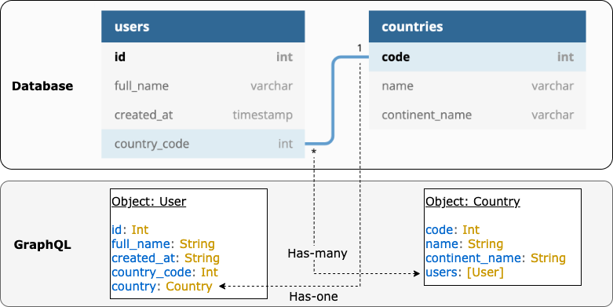

# Phrag

**GraphQL directly from RDBMS Schema**

Phrag creates a GraphQL handler by scanning DB schema. All needed is a DB connection.

It also comes with a signal feature to inject custom logics per table accesses.

#### Features:

- CRUD operations (`query` and `create`/`update`/`delete` mutations) created per resource with [Lacinia](https://github.com/walmartlabs/lacinia).

- `One-to-one`, `one-to-many`, `many-to-many` and `circular many-to-many` relationships as nested query objects according to a [design](#query-relationships).

- Data loader (query batching) to avoid N+1 problem for nested queries, leveraging [superlifter](https://github.com/seancorfield/honeysql) and [Urania](https://github.com/funcool/urania)

- Aggregation queries for root entity and has-many relationships.

- Resource [filtering](#resource-filtering), [sorting](#resource-sorting) and [pagination](#resource-pagination) as arguments in query operations.

- [Signals](#signals) to inject custom logics before & after DB accesses per resource operations.

- Options to use schema retrieved from a database, selectively override it or entirely base on provided data through [config](#phrag-config).

- Automatic router wiring for [reitit](https://github.com/metosin/reitit) and [bidi](https://github.com/juxt/bidi).

- GraphQL IDE (like GraphiQL) connectable.

#### Notes:

- Supported databases are SQLite and PostgreSQL.

- This project is currently in POC/brush-up stage for a real project usage, so it's not been published to Clojars yet.

### Usage

Create ring app with reitit route using Integrant

```clojure
{:phrag.core/reitit-graphql-route {:db (ig/ref :my-db/connection)}
 ::app {:routes (ig/ref :phrag.core/reitit-graphql-route)}}
```

### Design

Phrag focuses on constraints to let database schema represent application data structure.

##### Query Relationships

Phrag transforms a foreign key (FK) constraint into nested query objects of GraphQL as the diagram below.



This is a fundamental concept for Phrag to support multiple types of relationships.

##### Mutations

Primary key (PK) constraints are identifier constructs of mutations. `create` operations return PK column fields and `update`/`delete` operations require them as identifier data.

<!---
> Notes:
> * There is an option to detect relations from table/column names, however it comes with a limitation since matching names such as `user_id` for `users` table are required.
-->

### Config

Though there are multiple options for customization, the only config parameter required for Phrag is a database connection.

#### Config Parameters

| Key                  | description                                                                                                  | Required | Default Value |
| -------------------- | ------------------------------------------------------------------------------------------------------------ | -------- | ------------- |
| `:db`                | Database connection object.                                                                                  | Yes      |               |
| `:tables`            | List of custom table definitions. Plz check [Schema Data](#schema-data) for details.                         | No       |               |
| `:signals`           | Map of singal functions per resources. Plz check [Signals](#signals) for details.                            | No       |               |
| `:signal-ctx`        | Additional context to be passed into signal functions. Plz check [Signals](#signals) for details.            | No       |               |
| `:use-aggregation`   | `true` if aggregation is desired on root entity queries and has-many relationships.                          | No       | `true`        |
| `:scan-schema`       | `true` if DB schema scan is desired for resources in GraphQL.                                                | No       | `true`        |
| `:no-fk-on-db`       | `true` if there's no foreign key is set on DB and relationship detection is desired from column/table names. | No       | `false`       |
| `:table-name-plural` | `true` if tables uses plural naming like `users` instead of `user`. Required when `:no-fk-on-db` is `true`.  | No       | `true`        |

#### Schema Data

By default, Phrag retrieves DB schema data through a DB connection and it is sufficient to construct GraphQL. Yet it is also possible to provide custom schema data, which can be useful to exclude certain columns and/or relationships from specific tables. Custom schema data can be specified as a list of tables under `:tables` key in the config map.

```edn
{:tables [
   {:name "users"
    :columns [{:name "id"
       	       :type "int"
               :notnull 0
               :dflt_value nil}
              {:name "image_id"
               :type "int"
               :notnull 1
               :dflt_value 1}
	           ;; ... more columns
	           ]
    :fks [{:table "images" :from "image_id" :to "id"}]
    :pks [{:name "id" :type "int"}]}
    ;; ... more tables
    ]}
```

##### Table Data Details:

| Key        | Description                                                                                      |
| ---------- | ------------------------------------------------------------------------------------------------ |
| `:name`    | Table name.                                                                                      |
| `:columns` | List of columns. A column can contain `:name`, `:type`, `:notnull` and `:dflt_value` parameters. |
| `:fks`     | List of foreign keys. A foreign key can contain `:table`, `:from` and `:to` parameters.          |
| `:pks`     | List of primary keys. A primary key can contain `:name` and `:type` parameters.                  |

> Notes:
>
> - When `:scan-schema` is `false`, Phrag will construct GraphQL from the provided table data only.
> - When `:scan-schema` is `true`, provided table data will override scanned table data per table properties: `:name`, `:table-type`, `:columns`, `:fks` and `:pks`.

### Signals

Phrag can signal configurable functions per resource queries/mutations at pre/post-DB operation time. This is where things like access controls or custom business logics can be configured.

> Notes:
>
> - Resource operation types include `query`, `create`, `update` and `delete`. (`query` signals happen in relations as well.)
> - Signal receiver functions are called with different parameters per types:
>   - A `pre-query` function will have its first argument which is a map of SQL parameters including `where` (in [HoneySQL](https://github.com/seancorfield/honeysql) format), `sort`, `limit` and `offset`, and its returned value will be passed to a subsequent DB operation.
>   - A `pre-mutation` function will have request parameters as its first argument, and its returned value will be passed to a subsequent DB operation.
>   - A `post-query/mutation` function will have a resolved result as its first argument when called, and its returned value will be passed to a result response.
>   - All receiver functions will have a context map as its second argument. It'd contain a signal context specified in a Phrag config together with a DB connection and an incoming HTTP request.
>   - If `nil` is returned from `pre-mutation` functions, DB operations will be skipped and exception will be thrown.
>   - `:all` can be used at each level of signal map to run signal functions across all tables, all operations for a table, or both timing for a specific operation.

Here's some examples:

```clojure
(defn- end-user-access
  "Restrict access to request user"
  [sql-args ctx]
  (let [user (user-info (:request ctx))]
    (if (admin-user? user))
      sql-args
      (update sql-args :where conj [:= :user_id (:id user)])))

(defn- hide-internal-id
  "Removes :internal-id for non-admin users"
  [result ctx]
  (let [user (user-info (:request ctx))]
    (if (admin-user? user))
      result
      (update result :internal-id nil)))

(defn- update-owner
  "Updates :created_by with auth user"
  [args ctx]
  (let [user (user-info (:request ctx))]
    (if (end-user? user)
      (update args :created_by (:id user))
      args)))

;; Multiple signal function can be specified as a vector.

(def example-config
  {:signals {:all [check-user-auth check-user-role]
             :users {:query {:pre end-user-access
                             :post hide-internal-id}
                     :create {:pre update-owner}
                     :update {:pre update-owner}}}})
```

### Resource Filtering

Format of `where: {column-a: {operator: value} column-b: {operator: value}}` is used in arguments for filtering. `AND` / `OR` group can be created as clause lists in `and` / `or` parameter under `where`.

> - Supported operators are `eq`, `ne`, `gt`, `lt`, `gte`, `lte`, `in` and `like`.
> - Multiple filters are applied with `AND` operator.

##### Example:

`{users (where: {name: {like: "%ken%"} or: [{age: {eq: 20}}, {age: {eq: 21}}]})}` (`users` where `name` is `like` `ken` `AND` `age` is `20` `OR` `21`)

### Resource Sorting

Format of `sort: {[column]: [asc or desc]}` is used in query arguments for sorting.

##### Example:

`sort: {id: asc}` (sort by `id` column in ascending order)

### Resource Pagination

Formats of `limit: [count]` and `offset: [count]` are used in query arguments for pagination.

> - `limit` and `offset` can be used independently.
> - Using `offset` can return different results when new entries are created while items are sorted by newest first. So using `limit` with `id` filter or `created_at` filter is often considered more consistent.

##### Example

`(where: {id: {gt: 20}} limit: 25)` (25 items after/greater than `id`:`20`).

### Environment

To begin developing, start with a REPL.

```sh
lein repl
```

Then load the development environment with reitit example.

```clojure
user=> (dev-reitit)
:loaded
```

Run `go` to prep and initiate the system.

```clojure
dev=> (go)
:initiated
```

By default this creates a web server at <http://localhost:3000>.

When you make changes to your source files, use `reset` to reload any
modified files and reset the server.

```clojure
dev=> (reset)
:reloading (...)
:resumed
```

### Testing

Testing is fastest through the REPL, as you avoid environment startup
time.

```clojure
dev=> (test)
...
```

But you can also run tests through Leiningen.

```sh
lein eftest
```

## Legal

Copyright © 2021 Yohei Kusakabe
