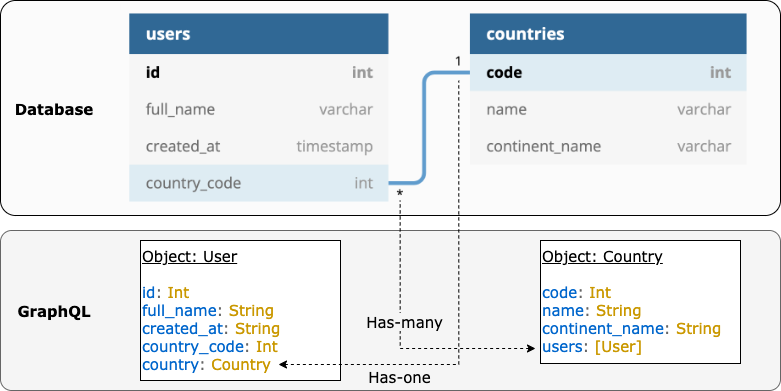

## Mechanism

## Queries

Tables and/or views become queryable as root objects of GraphQL in Phrag. This is for flexible data access without being constrained to certain query structures defined in GraphQL schema. Data can be accessed at a root level or as a nested object together with parent objects through relationships.

In terms of query format, Phrag does not use [cursor connection](https://relay.dev/graphql/connections.htm). It is an intentional design decision since Phrag features universal argument interfaces for filtering and pagination across root queries and nested objects.

### Relationships

Phrag transforms a foreign key constraint into nested query objects of GraphQL as illustrated in the diagram below. This is a fundamental concept for Phrag to support multiple types of relationships:

### SQL Queries

N+1 problem is an anti-pattern where a relationship query is executed for every one of retrieved records. Phrag's query resolver implements a batched SQL query per nest level to avoid N+1 problem.

It should also be noted that Phrag does not use `JOIN` for relationship queries to allow `LIMIT` on nested objects.

## Mutations

`Create`, `update` and `delete` mutations are created for each table. Primary keys work as an identitier of each record for mutations:

1. Phrag registers PK(s) of a table as a GraphQL object.

2. `Create` mutation returns a PK object with generated values as a successful response.

3. `Update` or `delete` mutation requires the PK object as a parameter to identify the record for the operations.

## Security

- **Infinite nests:** nested objects created for both origin and destination columns of foreign keys actually mean possible infinite nests, and it is possibly an attack surface when a user queries millions of nests. Phrag has a [config](config.md) value, `max-nest-level` for this, and an error response will be returned when a query exceed the nest level specified.

- **Default limit:** querying millions of records can be resource-intensive and we don't want it to happen accidentally. [Config](config.md) value of `default-limit` can be used to apply default limit value when there's no `limit` parameter specified in a query.
